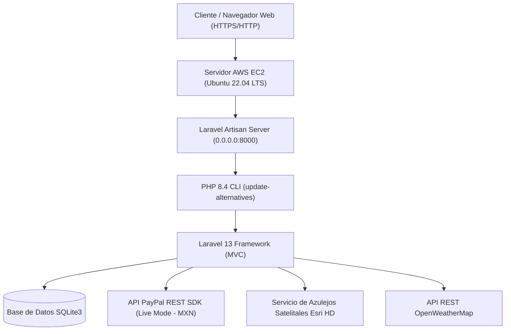
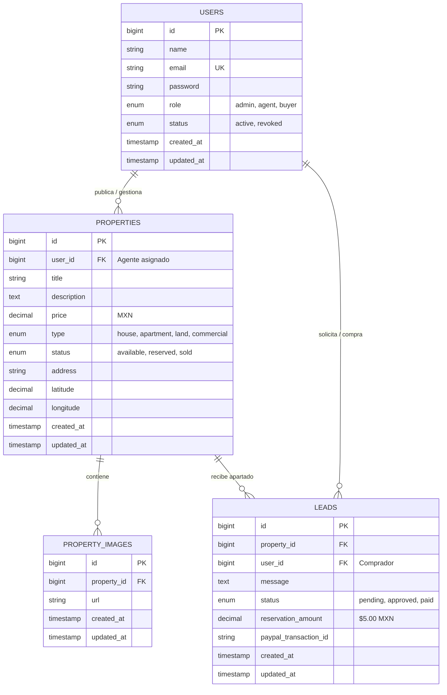

# Manual Técnico y Funcional Exhaustivo - SGNIA Real Estate

Este documento contiene la especificación técnica, funcional y de arquitectura completa del sistema **SGNIA Real Estate**, desarrollado para el mercado inmobiliario geolocalizado en Nopalucan de la Granja, Puebla.

---

## 1. Visión General del Sistema

**SGNIA Real Estate** es una plataforma web *Full-Stack* construida con **Laravel 13** y **PHP 8.4**, alojada en la nube de **Amazon Web Services (AWS EC2 - Ubuntu Server 22.04 LTS)**. 

El sistema digitaliza el proceso inmobiliario integral:
1. Exploración de inmuebles en tarjetas con modo oscuro (*dark slate mode*).
2. Inspección cartográfica mediante imágenes satelitales en alta definición (API Esri World Imagery).
3. Consulta meteorológica local en tiempo real (API OpenWeatherMap).
4. Solicitud de información y apartado directa entre comprador y agente.
5. Aprobación y gestión de prospectos desde un panel administrativo con roles (*RBAC*).
6. Pago digital del enganche de apartado ($5.00 MXN) mediante **PayPal Live Checkout**.
7. Bloqueo automático del inmueble a estado `Reservado 🔒`.
8. Generación e impresión de un **Comprobante Oficial de Pago de Reserva en PDF (1 página carta)** con membrete fiscal (RFC), coordenadas y sello digital de transacción PayPal.

---

## 2. Arquitectura de Infraestructura y Servidor Cloud (AWS EC2)



### Especificaciones del Entorno AWS:
- **Proveedor:** AWS Academy / Vocareum EC2.
- **Sistema Operativo:** Ubuntu Server 22.04 LTS (`x86_64`).
- **Runtime de PHP:** PHP 8.4.24 CLI (con extensiones `php8.4-cli`, `php8.4-mbstring`, `php8.4-xml`, `php8.4-sqlite3`, `php8.4-curl`, `php8.4-intl`, `php8.4-zip`).
- **Gestor de Paquetes:** Composer 2.x & Node.js 22.
- **Base de Datos:** SQLite3 optimizada para operaciones en la nube.
- **Reglas de Seguridad (Security Group):**
  - Custom TCP `8000` (`0.0.0.0/0`) ➔ Servidor web Laravel.
  - HTTP `80` (`0.0.0.0/0`) ➔ Tráfico web estándar.
  - SSH `22` ➔ Administración remota.

---

## 3. Modelo de Base de Datos y Esquema Relacional

El sistema utiliza 4 tablas de negocio principales interconectadas mediante llaves foráneas y el ORM Eloquent:



---

## 4. Módulos y Funcionalidades Detalladas

### Módulo 1: Autenticación y Control de Acceso basado en Roles (RBAC)
- **Registro de Usuarios (`/register`):** Permite el registro inmediato de compradores con validación de nombre, correo único y contraseña estructurada.
- **Política de Contraseñas Fuertes:** Validación estricta en `AuthController.php` exigiendo mínimo 8 caracteres con letras y números obligatorios (`Password::min(8)->letters()->numbers()`).
- **Defensa Anti Fuerza Bruta (Rate Limiting):** Bloqueo automático por 60 segundos tras 5 intentos fallidos de inicio de sesión por IP (`RateLimiter::hit('login:' . $request->ip(), 60)`).
- **Revocación de Agentes Activos:** Si un administrador cambia el estado de un agente a `revoked`, el middleware de autenticación deniega su acceso de inmediato.

#### Matriz de Roles y Permisos:
| Funcionalidad | Comprador (`buyer`) | Agente (`agent`) | Administrador (`admin`) |
| :--- | :---: | :---: | :---: |
| Explorar Catálogo y Mapas Satelitales | ✅ | ✅ | ✅ |
| Enviar Solicitud de Información | ✅ | ❌ | ❌ |
| Pagar Enganche de Apartado (PayPal Live) | ✅ | ❌ | ❌ |
| Descargar Comprobante Oficial PDF | ✅ | ✅ | ✅ |
| Publicar Nuevas Propiedades | ❌ | ✅ | ✅ |
| Eliminar Propiedades Propias | ❌ | ✅ | ✅ |
| Aprobar Solicitudes de Apartado | ❌ | ✅ | ✅ |
| Aprobar / Revocar Acceso a Agentes | ❌ | ❌ | ✅ |

---

### Módulo 2: Motor Cartográfico SIG Satelital y Clima
- **Imágenes Satelitales HD (Esri World Imagery):** Integración con Leaflet.js utilizando azulejos en tiempo real de Esri (`https://server.arcgisonline.com/ArcGIS/rest/services/World_Imagery/MapServer/tile/{z}/{y}/{x}`).
- **Geolocalización en Nopalucan de la Granja:** Coordenadas de referencia iniciales ajustadas a Puebla (`19.1245, -97.8012`).
- **Marcadores Interactivos:** Ventanas emergentes en modo oscuro (*dark popups*) con precio formateado en MXN, dirección completa y enlace directo a la ficha.
- **Widget de Clima Local (OpenWeatherMap REST API):** Endpoint asíncrono AJAX en `/api/properties/{property}/weather` que obtiene temperatura en °C, humedad, velocidad del viento y descripción meteorológica de Nopalucan en tiempo real.

---

### Módulo 3: Pasarela de Pagos Digitales (PayPal Live Mode)
- **Credenciales PayPal Live:**
  - **Nombre de la App:** `SGNIA Real Estate`
  - **Live Client ID:** `BAATq23yNkLaE92Ew_XUHcj5u3-xFEDjelhR4S2J-qjX4vl5BBCTTCsyS_z89LJRn0IrGpS-KyLY0F8wQM`
  - **Moneda de Transacción:** Pesos Mexicanos (`MXN`).
- **Flujo Técnico de Pago:**
  1. El cliente entra a su recibo/ficha en `/leads/{lead}/receipt`.
  2. El SDK JavaScript de PayPal renderiza los botones oficiales de pago.
  3. El cliente autoriza la transacción de apartado ($5.00 MXN).
  4. Al capturar la orden en PayPal, el cliente envía un request `POST` asíncrono a `/leads/{lead}/pay-paypal` incluyendo el token `X-CSRF-TOKEN` y el `paypal_transaction_id` devuelto por la API.
  5. El servidor valida la orden, actualiza el estado de la solicitud a `paid` y cambia el estado del inmueble en la base de datos a `reserved` (Reservado 🔒).

---

### Módulo 4: Generación e Impresión del Comprobante Oficial en PDF
- **Membrete Empresarial e Identidad Fiscal:**
  - **Razón Social:** `SGNIA Real Estate S.A. de C.V.`
  - **RFC Registrado:** `SGN-260721-H80`
  - **Domicilio Fiscal:** `Avenida 2 Poniente 4, Centro, 75120 Nopalucan de la Granja, Pue., México`
  - **Contacto:** `Tel: +52 223 131 6588 | Email: sgniacompany@corporacion.com`
- **Desglose Financiero Incluido:**
  - Folio de Recibo Único (`SGNIA-REC-2026-00X`).
  - ID de Transacción Autorizada por PayPal.
  - Marca de tiempo exacta del servidor (`d/m/Y h:i:s A`).
  - Precio Total del Inmueble en MXN.
  - Enganche de Apartado Pagado ($5.00 MXN).
  - Saldo Pendiente a Escrituración.
  - Datos completos del Cliente Comprador y Agente Asignado.
- **Motor de Impresión PDF (`@media print`):**
  - Oculta automáticamente barra de navegación, menús y botones (`.no-print`).
  - Fuerza contraste con texto en negro profundo (`#0f172a`) sobre hojas blancas.
  - Configurado con `@page { size: letter portrait; margin: 6mm 8mm; }` y rejilla en 2 columnas fijas para garantizar que el comprobante se imprima exactamente en **1 sola hoja tamaño carta**.

---

### Módulo 5: Capa de Seguridad Defensiva y Middlewares
- **Middleware de Cabeceras de Seguridad HTTP (`SecurityHeadersMiddleware.php`):**
  - `X-Frame-Options: SAMEORIGIN` ➔ Previene ataques de Clickjacking.
  - `X-Content-Type-Options: nosniff` ➔ Previene MIME-sniffing.
  - `X-XSS-Protection: 1; mode=block` ➔ Protección contra Cross-Site Scripting.
  - `Referrer-Policy: strict-origin-when-cross-origin` ➔ Protección de privacidad en referers.
- **Protección contra Inyección SQL:** Consultas 100% preparadas utilizando el ORM Eloquent y PDO Parameter Binding.
- **Protección contra Falsificación de Peticiones en Sitios Cruzados (CSRF):** Validación obligatoria de tokens `@csrf` en todos los formularios y llamadas AJAX.

---

## 5. Directorio Completo de Rutas del Sistema (23 Rutas)

```text
+--------+---------------------------------+-------------------------+-----------------------------------+
| Método | Ruta                            | Nombre de Ruta          | Controlador @ Acción              |
+--------+---------------------------------+-------------------------+-----------------------------------+
| GET    | /                               | properties.index        | PropertyController@index          |
| GET    | /properties/{property}          | properties.show         | PropertyController@show           |
| GET    | /api/properties                 | api.properties.index    | PropertyController@apiIndex       |
| GET    | /api/properties/{property}/w... | api.properties.weather  | PropertyController@apiWeather     |
| GET    | /login                          | login                   | AuthController@showLoginForm      |
| POST   | /login                          | login.post              | AuthController@login              |
| GET    | /register                       | register                | AuthController@showRegisterForm   |
| POST   | /register                       | register.post           | AuthController@register           |
| POST   | /logout                         | logout                  | AuthController@logout             |
| GET    | /my-requests                    | client.leads            | LeadController@myLeads            |
| POST   | /properties/{property}/leads    | leads.store             | LeadController@store              |
| GET    | /leads/{lead}/receipt           | leads.receipt           | LeadController@showReceipt        |
| POST   | /leads/{lead}/pay-paypal        | leads.pay-paypal        | LeadController@processPaypalPa... |
| GET    | /admin/dashboard                | admin.dashboard         | AdminController@dashboard         |
| GET    | /admin/properties/create        | admin.properties.create | AdminController@createProperty    |
| POST   | /admin/properties               | admin.properties.store  | AdminController@storeProperty     |
| DELETE | /admin/properties/{property}    | admin.properties.destroy| AdminController@deleteProperty    |
| POST   | /admin/leads/{lead}/approve     | admin.leads.approve     | AdminController@approveLead       |
| POST   | /admin/agents/{user}/approve    | admin.agents.approve    | AdminController@approveAgent      |
| POST   | /admin/agents/{user}/revoke     | admin.agents.revoke     | AdminController@revokeAgent       |
+--------+---------------------------------+-------------------------+-----------------------------------+
```

---

## 6. Guía de Ejecución y Mantenimiento

### Comandos de Despliegue en AWS Cloud9:

```bash
# 1. Actualizar repositorio
git pull origin main

# 2. Asegurar versión por defecto de PHP 8.4
sudo update-alternatives --set php /usr/bin/php8.4

# 3. Encender el servidor en vivo en el puerto 8000
php artisan serve --host=0.0.0.0 --port=8000
```

### Ejecución de Pruebas Automatizadas:

```bash
php artisan test
```

*Resultado esperado: `{"tool":"phpunit","result":"passed","tests":2,"passed":2,"assertions":2}`.*

---

© 2026 **SGNIA Real Estate S.A. de C.V.** • Todos los Derechos Reservados.
